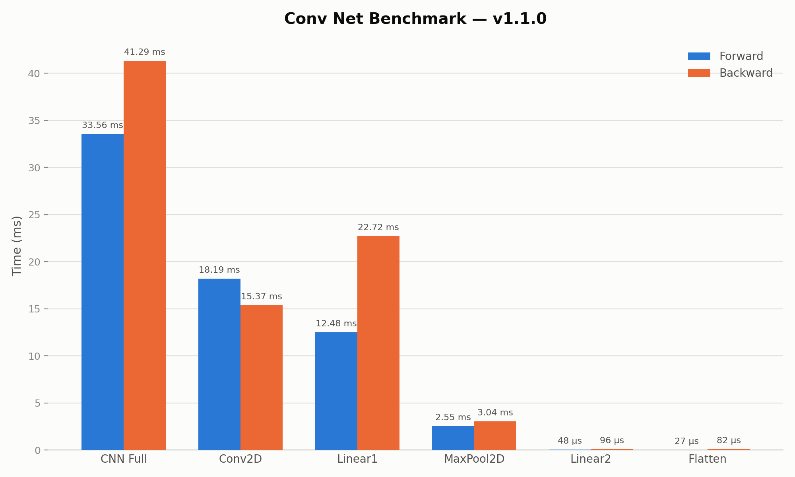

# Benchmark v1.1.0

**Date:** 2026-07-23 | **System:** Apple M3 (2023), Release build

## Baseline

This is the structured benchmark for the version `v1.1.0`, implementing the correct `Conv2D` implementation based on im2col.

## Results

| Component | Forward | Backward |
|---|---|---|
| **Full CNN pipeline** | **33.56 ms** | **41.29 ms** |
| Conv2D | 18.19 ms | 15.37 ms |
| Linear1 | 12.48 ms | 22.72 ms |
| MaxPool2D | 2.55 ms | 3.04 ms |
| Linear2 | 48 µs | 96 µs |
| Flatten | 27 µs | 82 µs |

The visualized results can be seen below.



The visualization has been generated using the Python Script `visualize_metrics.py`, as shown below.

```bash
python3 benchmarks/visualize_metrics.py \
    benchmarks/results/v1.1.0.json \
    -o notes/benchmarks/visualizations/v1.1.0-convnet.png
```

## Interpretation

Combining forward and backward, `Conv2D` and `Linear1`
are by far the two largest contributors to a full training step, accounting for ~91% of the forward and ~92% of the backward pass of the entire CNN network.

## Interesting finding: Conv2D forward is slower than Conv2D backward

This is counter-intuitive. For `Linear1`, backward (22.72 ms) costs ~1.82x forward (12.48 ms) — matching the expected theory that `matmul`'s backward does two full matrix multiplications (`grad_a`, `grad_b`) versus one in forward.

**Forward:**

```cpp
// Forward: y = x @ W.T + b
auto w_t = transpose_autodiff(weights_);  // Use autodiff transpose!
auto z = matmul_autodiff(x, w_t);         // {batch, out_features}

// Reshape bias from {out_features, 1} to {1, out_features}
auto bias_reshaped = reshape_autodiff(bias_, {1, out_features_});
auto y = add_autodiff(z, bias_reshaped);
```

**Backward:**

```cpp
auto& a = inputs[0];
auto& b = inputs[1];

Tensor grad_a = grad_result.matmul(b->transpose());
Tensor grad_b = a->transpose().matmul(grad_result);

a->accumulate_gradient(grad_a);
b->accumulate_gradient(grad_b);

if (a->creator_node_) a->backward_impl(grad_a);
if (b->creator_node_) b->backward_impl(grad_b);
```

The backward pass of `Conv2D` should, by the same reasoning, cost at least as much as forward, yet it is about 15% cheaper.

### Investigation via Profiling

Using the implemented utilities under `profiling/` we found, that the flame graphs of forward and backward both look reasonable. Still, there was a difference in the forward pass, showing time spent during heap allocation (`operator new(unsigned long)`) when calling `operator+()`, which was not present in the backward pass. This finding led to the hypothesis, that this allocation could potentially be the reason for the overhead created during the forward pass.

Note, that the allocation of the vector `coords` in the Tensor method `operator+()` happens at every iteration of the implemented for loop as seen below.

```cpp
for (size_t i = 0; i < result.size(); ++i) {
    // Convert flat index to multi-dimensional coordinates
    std::vector<size_t> coords(result_shape.size());

    // ...
}
```

When the Tensor `result` is large enough, this leads to many heap allocations of the underlying data, becoming a performance issue quickly.

## Next Steps

Based on the results obtained above, the unexpected behaviour of the Conv2D layer (cheaper backward- than forward-pass) must be further investigated. Considering the hypothesis, the logic of allocating the `coords` vector should be re-thought and potentially adapted.

***Check the results of the refactoring in bm-v1.1.1.md!***
