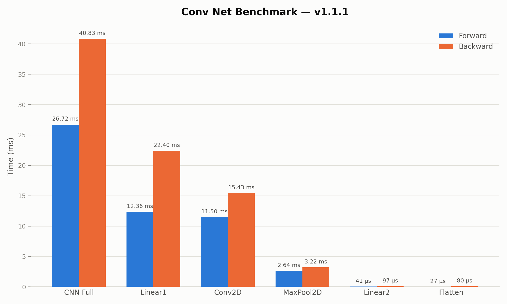

# Benchmark v1.1.1

**Date:** 2026-07-26 | **System:** Apple M3 (2023), Release build

## Goal

The goal of the adaptions from version `v1.1.0` to `v1.1.1` were to tackle the heap allocation issue, found during profiling of the Conv2D forward pass.

## Changes

The changes made are very simple. As described in `bm-v1.1.0.md` we found, that the code-snippet

```cpp
for (size_t i = 0; i < result.size(); ++i) {
    // Convert flat index to multi-dimensional coordinates
    std::vector<size_t> coords(result_shape.size());

    // ...
}
```

from the `operator+()`, `operator+=()`, `operator-()`, and `operator-=()` performs heap allocations for the values of the vector `coords` in every iteration of the for-loop. The refactoring simply pulled the allocation out of the loop, like seen below.

```cpp
// Allocate the coords vector once outside of the loop, re-use in the loop
std::vector<size_t> coords(result_shape.size());
for (size_t i = 0; i < result.size(); ++i) {
    // Re-use here
}
```

## Results

| Component | Forward | Backward |
|---|---|---|
| **Full CNN pipeline** | **26.72 ms** | **40.83 ms** |
| Linear1 | 12.36 ms | 22.40 ms |
| Conv2D | 11.50 ms | 15.43 ms |
| MaxPool2D | 2.64 ms | 3.22 ms |
| Linear2 | 41 µs | 97 µs |
| Flatten | 27 µs | 80 µs |

The visualization can be seen below.



Voilà! We finally see the expected result, the anomaly of the Conv2D layer's forward pass seems to be fixed!

## Learning from the Experiment

This experiment nicely shows, that questioning the results, even if we proudly admire the working software, is crucial! The result of the combination of benchmarking and profiling nicely revealed a small detail, fixed by only adapting one line of code in 4 different methods, which subsequently led to a performance improvement of ~36.8% (for the Conv2D forward pass)! 🚀
